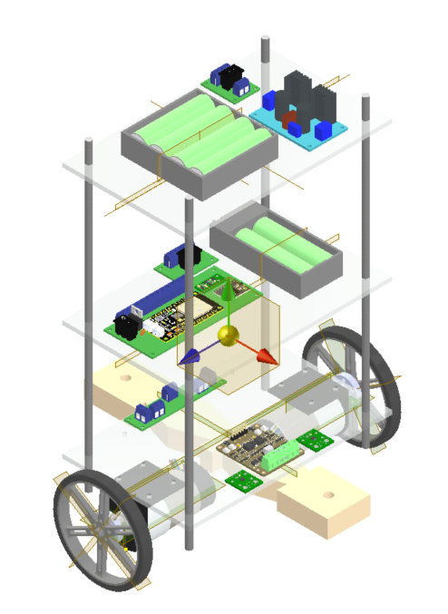
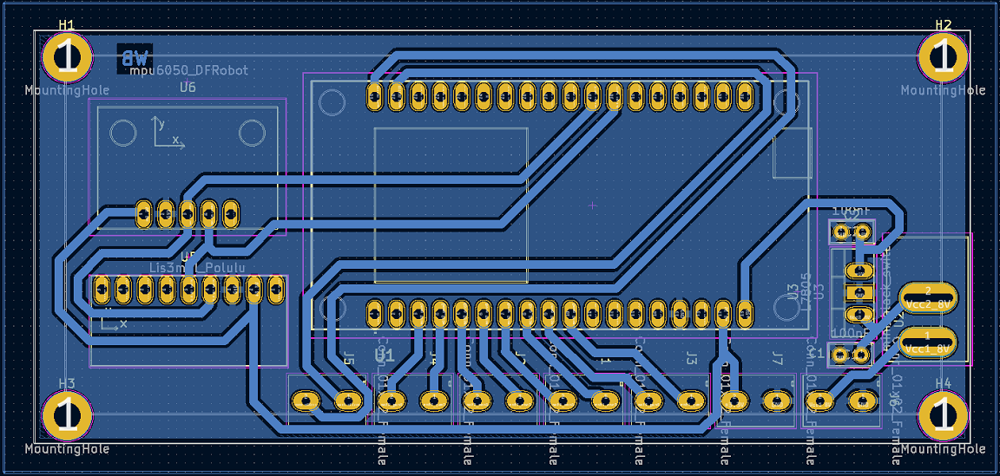
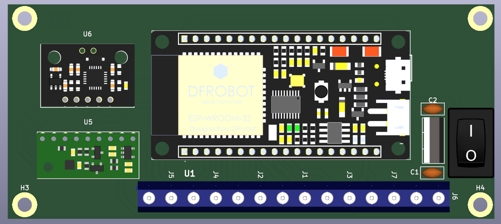
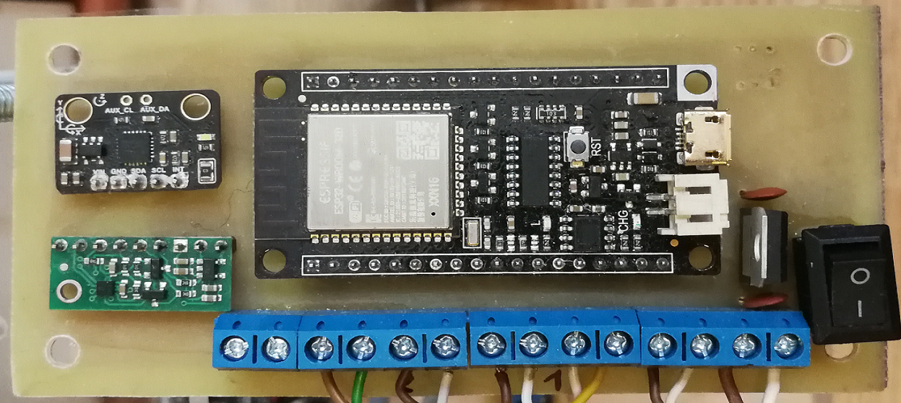

# Two-Wheeled Balancing Robot Project

## Overview
Repository contains code for microcontroller ESP-32 with implemented control system with LQR regulator. Microcontroller connects to local network and acts like a web server, providing GUI on website to control vehicle. Matlab scripts were used to calculate mathematical model and simulink system was designed to veryficate close loop system. 

## Table of Contents
1. [ESP32 Code](#esp32-code)
2. [MATLAB Code](#matlab-code)
3. [Inventor Project](#inventor-project)
4. [KiCad Project](#kicad-project)

## ESP32 Code
Code was written in PlatformIO extension with arduino framework. FreeRTOS was used with hardware interrupts and tasks for:
- service encoders
- measure imu data
- filter data with Kalman Filter
- calculate rest of state variables
- generate reference vector
- calculate control for motors
- log data 

### Files
- `main.cpp`: main file for the ESP32.
- `defines.cpp`: file with defines.
- `globals.cpp`: file with global variables used by tasks.
- `interrupts.cpp`: interrupts service routines.
- `tasks.cpp`: some utility functions.
- `web_server.cpp`: web server with html page.
- `platformio.ini`: configuration file used by PlatformIO extension.

## MATLAB Code
The MATLAB code is used to calculate mathematical model and simulate system.

### Files
- `s1_parameters.m`: script with system parameters.
- `s2_mathematical_model.m`: script for calculate unlinear and linear model as state-space matrixes.
- `sim1_unlinear_model_with_LQR.slx`: simulink close loop system with LQR regulator 

### How to Run
1. Open Matlab 2023b.
2. Run `s2_mathematical_model.m` to load parameters and calculate K matrix.
3. Run `sim1_unlinear_model_with_LQR.slx` to test system output for given reference velocities or different initial state.

## Inventor ProjectV
Image from Inventor project was included to repository. 3D model was created to design distribution of elements and to calculate parameters of vehicle inertia. 

### Images

    
    

    
<em>Figure 1: 3D model from Autodesk Inventor and real model.</em>

## KiCad Project
Images from KiCad project was included to repository. PCB board was created for electronic part from system to avoid EMI interferences from DC motors.

### Images

    
    
    

    
<em>Figure 2: designed paths, visualization, home made board</em>

